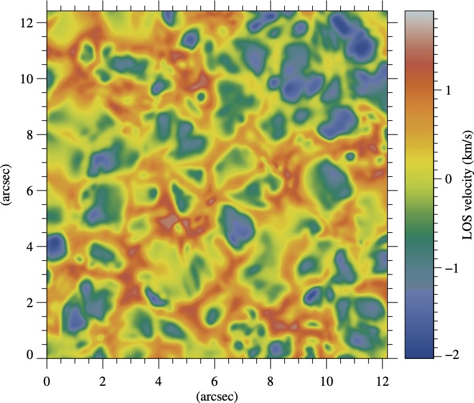

# LOS-velocity
### Line-of-sight velocity measurements (using a bisector approach)

Below are some simpel steps on how to read the (sample) data and run the code.

First, we read the profile(s) and their associated wavelengths. In this example, the data is a 2D image of 204 by 208 pixels, sampling a small part of the solar photosphere. At each pixel, we have sampled the Fe I 6173 Å spectral line at 10 wavelength positions (i.e., the cube contains 42432 profiles). Each profile is treated separately.

```sh
IDL> cube = readfits('sample_data/SST_6173_StokesI.fits', header)
% READFITS: Now reading 204 by 208 by 10 array
IDL> wavelengths = readfits('sample_data/SST_6173_StokesI.fits', ext=1)
% READFITS: Reading FITS extension of type IMAGE
% READFITS: Now reading 10 element vector
```

In this example, the wavelength positions were stored as an extension to the FITS cube.

Now, we run the main code, to calculate **bisectors** at each pixel (for each profile) and for all pixels over the entire field of view (FoV). Then the LOS velocities are calculated and returned. If desired, the bisectors may also be returned.

```sh
IDL> losv = bisector_los_velocity (cube, wavelengths)
... calculating bisectors
% Compiled module: POLY_FIT.
% Compiled module: INTERPOL.
... computing LOS velocities
>>> Reference (rest) wavelength: 6173.3408 Å
```

The calculated `losv` cube contains the LOS velocities of all pixels over the entire FoV at 10 intensity levels (starting from the line-core towards the continuum at 10% equidistant levels).

```sh
IDL> help, losv
LOSV            FLOAT     = Array[204, 208, 10]
```

Here is an example image of the LOS velocity at the 40% intensity level (i.e., losv[*,*,4]):



Please note that bisectors at the first level make no sense and should be excluded. Also, depending on the spectral line sampling, the last one or two may not be reliable (as they approach the continuum). In both cases (i.e., the line core and close to continuum the **bisector** measurements become invalid).

